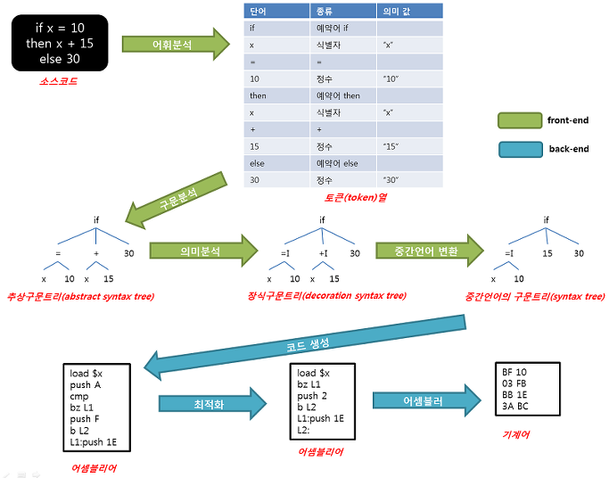

# Overview



# how to compile and run?

```cpp
cd dir/
clang++ *.cpp -std=c++17 -o main
./main
```


# What happen?

## 0. main

```cpp
function main() {
	print 'Hello, World!';
}
```

## 1. scanner

Scanner: The scanner is responsible for breaking down the source code into tokens (like words). These tokens are then passed to the parser.

```cpp
KIND        STRING
-----------------------
function    function
#identifier main
(           (
)           )
{           {
print       print
#String     Hello, World!
;           ;
}           }
#EndOfToken
```


## 2. parser

Parser: The parser is responsible for examining the tokens and determining the structure of the source code. It generates an intermediate representation of the code called an abstract syntax tree (AST), which is used by the code generator.

```cpp
FUNCTION main:
  BLOCK:
    PRINT:
      "Hello, World!"
```

## 3-1. interpreter

AST tree를 바로 해석해서 바로 실행.

```cpp
Hello, World!%
```

## 3-2. generator

Generator: The generator takes the abstract syntax tree (AST) and converts it into executable code. This code can then be run on a computer or other device.

tokens in AST tree -> assembly code 로 바꿔주는 놈.
assembly code는 특정 virtual machine이 읽을 수 있네 Instruction Set이 선언되어 있음.


```cpp
FUNCTION   ADDRESS
------------------
main       3

ADDR INSTRUCTION    OPERAND
------------------------------------
   0 GetGlobal      "main"
   1 Call           [0]
   2 Exit
   3 Alloca         [0]
   4 PushString     "Hello, World!"
   5 Print          [1]
   6 Return
```


## 4. virtual machine

run executable code in virtual machine!

1. generator가 만든 assembly code를 읽고
2. stack안에 sub_stacks, operand_stack 안에 순서대로 넣어서 순차 실행.
3. 이 때, return 같이 코드가 끝나는 부분은 mark-and-sweep GC도 해줌

```cpp
Hello, World!%
```
