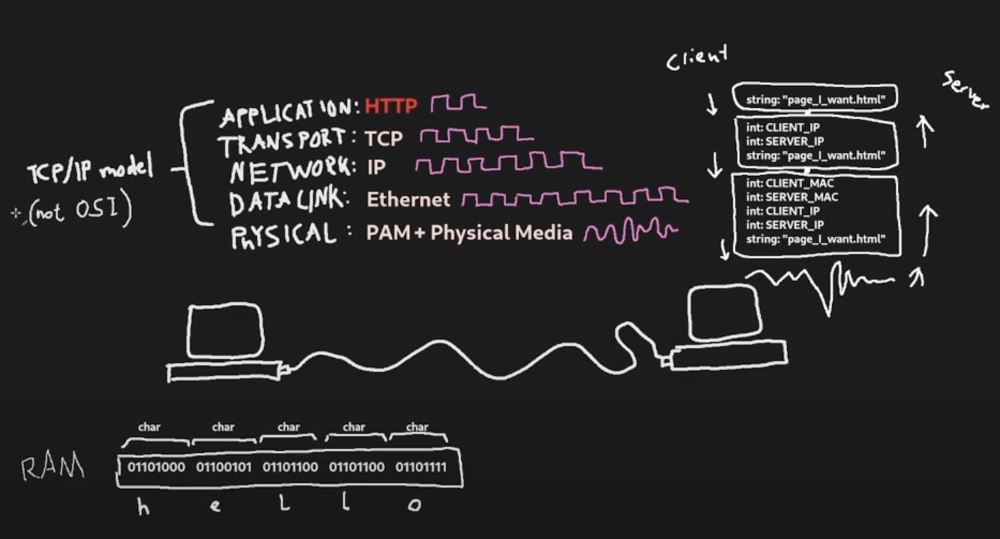
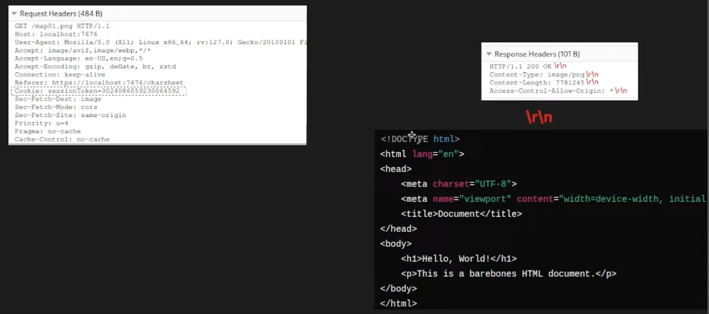

# A. what
http/1.1 protocol을 따르며, tcp protocol에 규격을 이용한 요청을 받아 응답 보내는 프로그램.

codecrafter's build your own http server 예제 code that runs on mac

reference: https://github.com/deidax/codecrafters-http-server-c


## a. summary

client <-> server가 TCP/IP, HTTP protocol 약속을 이용한 통신을 하는데,


1. client가 http request header에 RFC2616에 약속된 header를 보내면,
2. server가 이를 파싱해서, 요청한 header에 알맞는 http response를 보내줌.


## b. RFC2616
http/1.1 프로토콜 만들 때,
어느걸 기준으로 프로토콜 만들어야 함?
할 때 RFC2616을 참고하자.


## c. features

### 1. tcp/ip 3 way handshake 어떻게 구현했지?
TCP/IP's 3 way handshake is covered under the hood on os-layer.

#### step1. make socket for server
```c
server_fd = socket(AF_INET, SOCK_STREAM, 0);
```

#### step2. bind not-in-used ip address for the server socket
```c
if (bind(server_fd, (struct sockaddr *) &serv_addr, sizeof(serv_addr)) != 0) {
	printf("Bind failed: %s \n", strerror(errno));
	return 1;
}
```

#### step3. change server socket to listening state, accepting incoming connections

```c
if (listen(server_fd, connection_backlog) != 0) {
	printf("Listen failed: %s \n", strerror(errno));
	return 1;
}
```

#### step4. tcp/ip 3-way-handshake under the hood(by os)

right before step5 of accepting http request from client


#### step5. accept http request from client
```c
int client = accept(server_fd, (struct sockaddr *) &client_addr, &client_addr_len);
```

### 2. http request packet 받고 어떻게 파싱해서 response 내려줬지?
processResponse()에서 http request가 GET이냐 POST냐에 따라 분기처리
1. GET일 땐, 그냥 /echo/${string}인 경우, 서버에 print(string) 하거나,
2. GET인데 accept-encoding:gzip 이 http header에 포함된 경우, /echo/${string}에서 string을 gzip_encode 한다.
3. POST로 요청온 경우, 서버에 example.txt에 /echo/${string}에 string을 override한다.


### 3. 이걸로 게임 서버를 만들고 싶으면 어떻게 해야할까?
1. 일단 4인 게임이라고 치면, 게임 플레이어의 상태를 보관하는 object를 4개 만든 다음에,
2. 플레이어가 움직일 때마다, 움직인 좌표값을 client->server로 http request header에 적절한 분기처리될 정보를 담아 보내서
3. 서버에서 보관중인 플레이어의 상태값을 mutex같은 동기화 기법을 써서 변경


# B. how to build & run on mac?

## a. compile server
shell1
```
gcc -std=c11 app/server.c -o server -lz
./server
```

## b. echo 'hello' on server
shell2
```
curl http://localhost:4221/echo/hello
```

output
```
./server
Logs from your program will appear here!
Waiting for a client to connect...
Client connected: 1
GET /echo/hello HTTP/1.1
Host: localhost:4221
User-Agent: curl/8.4.0
Accept: */*


.....hello
```


## c. try gzip encoding
shell2
```
curl -H "Accept-Encoding: gzip" http://localhost:4221/echo/try_gzip_encoding
```

output

```
./server
Logs from your program will appear here!
Waiting for a client to connect...
Client connected: 1
GET /echo/compressed_content HTTP/1.1
Host: localhost:4221
User-Agent: curl/8.4.0
Accept: */*
Accept-Encoding: gzip


.....try_gzip_encoding
ENCODING...FOUND... gzip
Input size: 0 bytes
Compressed size: 20 bytes
```

## d. POST request to write string on server's example.txt file

```
./server --directory ./
```

```
curl -X POST -d "Hello, World" http://localhost:4221/files/example.txt
```

check example.txt
