# summary

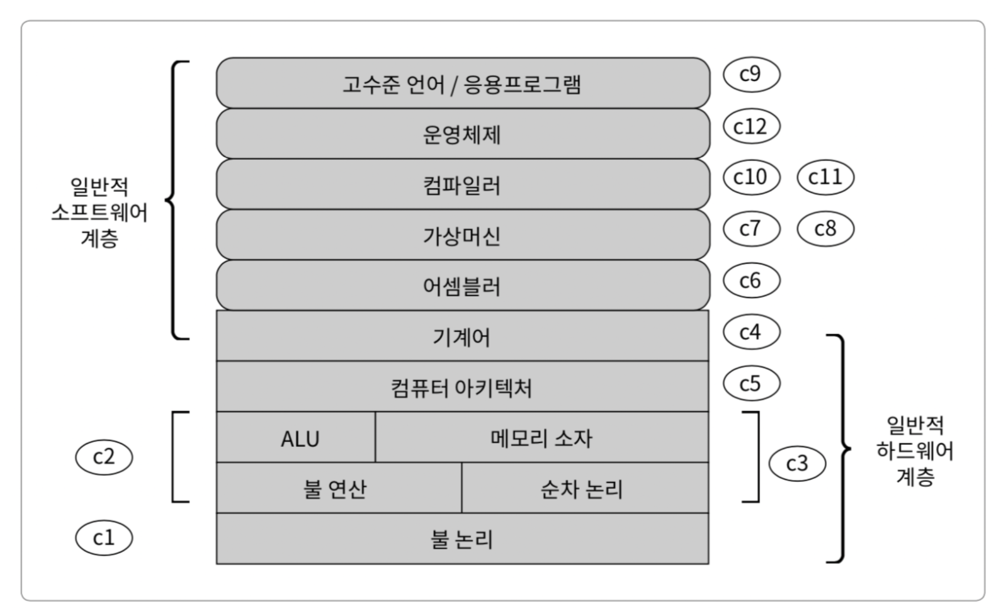
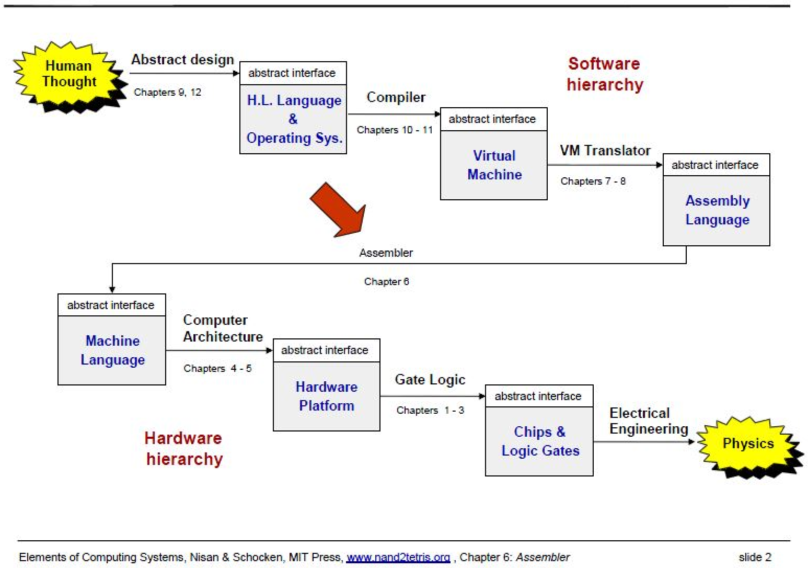

# index

A. hardware layer

1. boolean logic gate :white_check_mark:
2. boolean arithmetic :white_check_mark:
3. sequential logic :white_check_mark:
4. machine code :white_check_mark:
5. Von Neumann architecture :white_check_mark:

B. software layer

6. assembler
7. virtual machine - stack arthmetic
8. virtual machine - program control
9. compiler I - syntax analysis
10. compiler II - code generation
11. operating system
12. high level language


# todos

## 1장. boolean logic gate

0,1 boolean input 두개가 gate로 들어온다.

AND, NOT gate의 조합으로 nand, or, xor, multiplexor demultiplexor, bus, multibit, 다입력 (not, and, or, multiplexor) 을 만든다.


### 실습

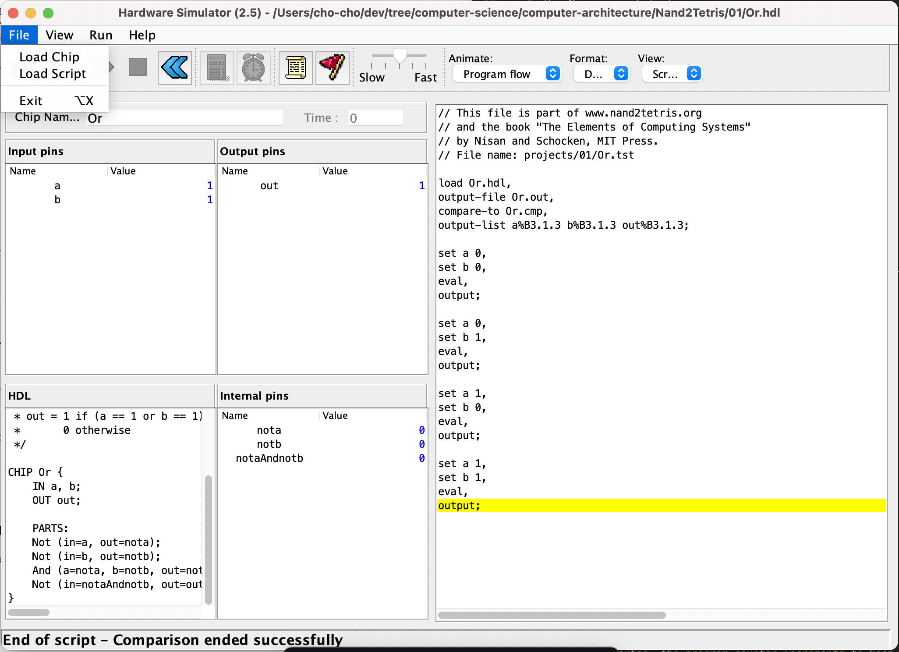

1. HardwareSimulator.sh 실행 (commandline > sh projects/tools/HardwareSimulator.sh)
2. file -> load chip 에서 and, not, or, xor 등의 chip을 로드하면, 왼쪽 하단 HDL에 PARTS 부분에 어떤 칩의 조합으로 해당 칩이 만들어 졌는지 뜬다.
3. file -> load script로 해당 칩의 test file을 로드. 오른쪽 화면에 테스트 케이스 별로 input, output이 뜬다.
4. 왼쪽 상단 >, >> 버튼 클릭해서 테스트 실행

### 0. 드모르간의 법칙

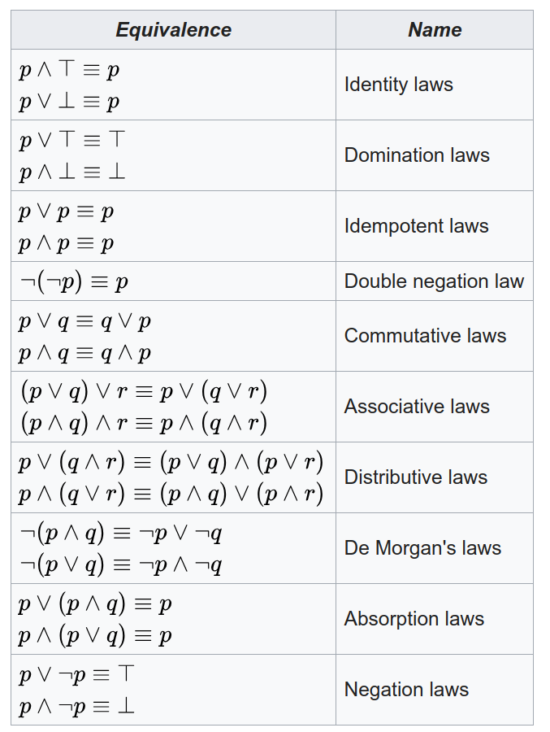


### 1. NOT's HDL

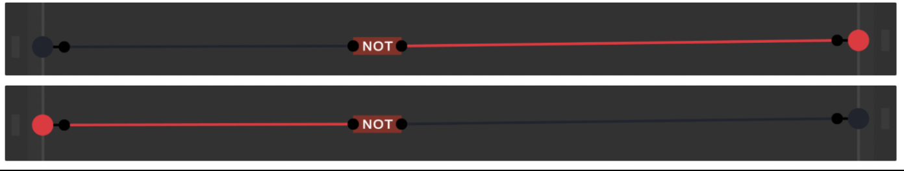

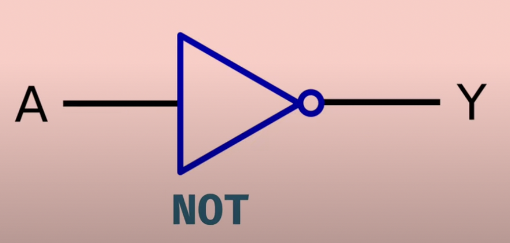

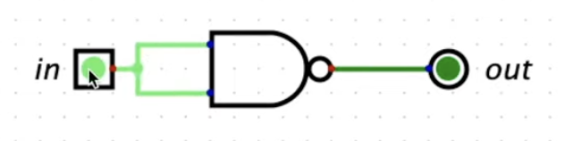

implement NOT gate using NAND gate


```
// This file is part of www.nand2tetris.org
// and the book "The Elements of Computing Systems"
// by Nisan and Schocken, MIT Press.
// File name: projects/01/Not.hdl

/**
 * Not gate:
 * out = not in
 */

CHIP Not {
    IN in;
    OUT out;

    PARTS:
    Nand (a=in, b=in, out=out);
	/* BUILTIN NOT;*/
}
```

Not x= x Nand x
..라는 점을 이용하여 Nand(a = in, b = in, out = out); 라고 서술한 것.

원래 연역식으로 작성하려면 먼저 not, and gate 가지고 nand를 만든 후, 쭉쭉 나가면 되는데,
이 방법보다 먼저 nand gate를 만들고 nand gate로 not, and 를 만드는게 칩 소모량이 덜 하기 때문에,
해당 프로젝트에서는 nand는 built-in으로 정의해두고, nand부터 시작함.


### 2. AND's HDL


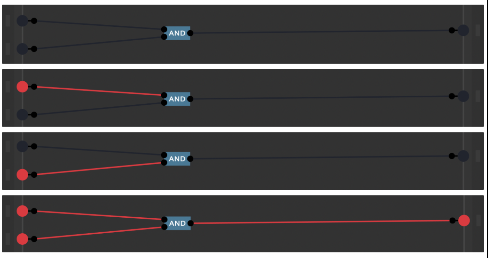

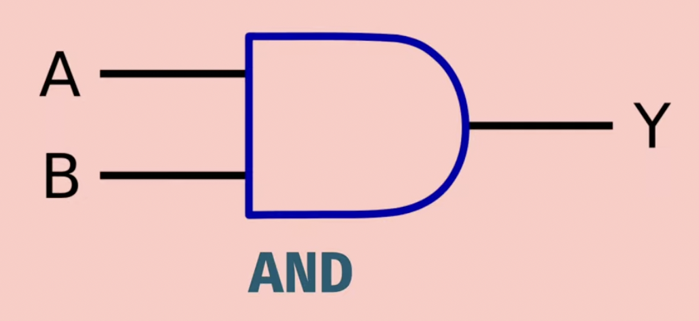

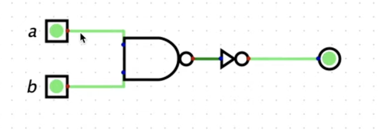

1 nand gate + 1 not gate

```
// This file is part of www.nand2tetris.org
// and the book "The Elements of Computing Systems"
// by Nisan and Schocken, MIT Press.
// File name: projects/01/And.hdl

/**
 * And gate:
 * out = 1 if (a == 1 and b == 1)
 *       0 otherwise
 */

CHIP And {
    IN a, b;
    OUT out;

    PARTS:
    Nand (a=a, b=b, out=val);
    Not (in=val, out=out);
}
```

원래 연역식으로 작성하려면 먼저 not, and gate 가지고 nand를 만든 후, 쭉쭉 나가면 되는데,
이 방법보다 먼저 nand gate를 만들고 nand gate로 not, and 를 만드는게 칩 소모량이 덜 하기 때문에,
해당 프로젝트에서는 nand는 built-in으로 정의해두고, nand부터 시작함.


### 3. NAND's HDL

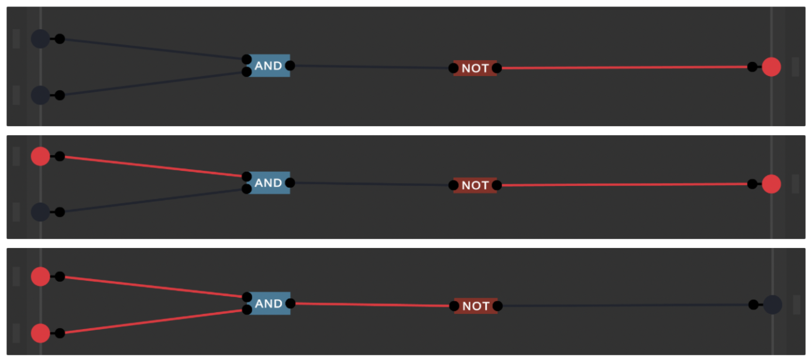


```
// This file is part of www.nand2tetris.org
// and the book "The Elements of Computing Systems"
// by Nisan and Schocken, MIT Press.
// File name: tools/builtIn/Nand.hdl

/**
 * Nand gate: out = a Nand b.
 */

CHIP Nand {

    IN  a, b;
    OUT out;

    BUILTIN Nand;
}
```
원래 연역식으로 작성하려면 먼저 not, and gate 가지고 nand를 만든 후, 쭉쭉 나가면 되는데,
이 방법보다 먼저 nand gate를 만들고 nand gate로 not, and 를 만드는게 칩 소모량이 덜 하기 때문에,
해당 프로젝트에서는 nand는 built-in으로 정의해두고, nand부터 시작함.


### 4. OR's HDL

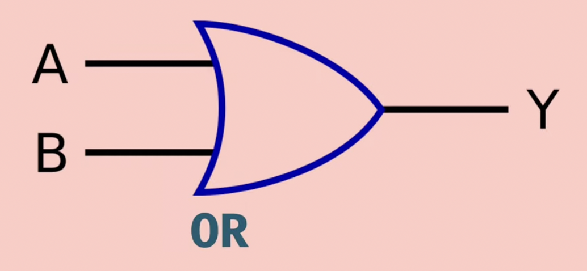

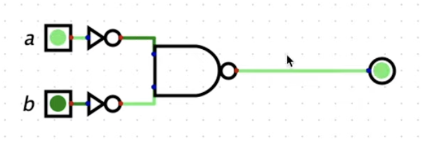

2 not gates + 1 nand gates

```
// This file is part of www.nand2tetris.org
// and the book "The Elements of Computing Systems"
// by Nisan and Schocken, MIT Press.
// File name: projects/01/Or.hdl

 /**
 * Or gate:
 * out = 1 if (a == 1 or b == 1)
 *       0 otherwise
 */

CHIP Or {
    IN a, b;
    OUT out;

    PARTS:
    Not (in=a, out=nota);
    Not (in=b, out=notb);
    And (a=nota, b=notb, out=notaAndnotb);
    Not (in=notaAndnotb, out=out);
}
```

### 5. XOR's HDL

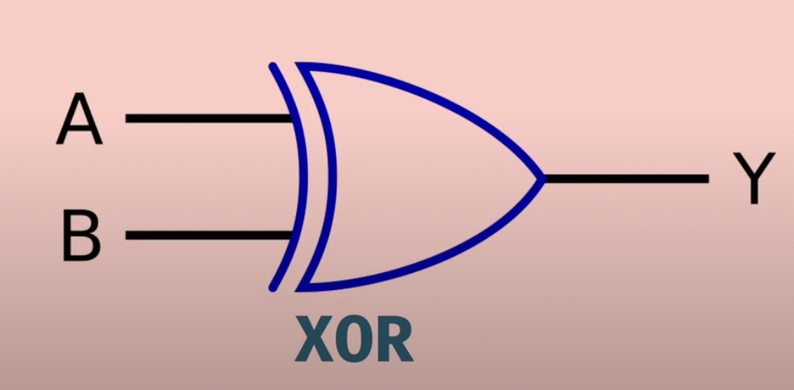

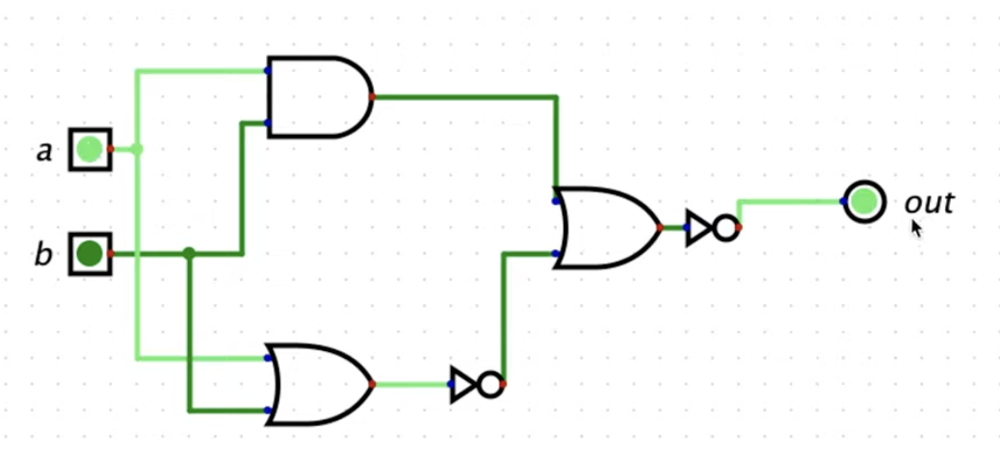


```
// This file is part of www.nand2tetris.org
// and the book "The Elements of Computing Systems"
// by Nisan and Schocken, MIT Press.
// File name: projects/01/Xor.hdl

/**
 * Exclusive-or gate:
 * out = not (a == b)
 */

CHIP Xor {
    IN a, b;
    OUT out;

    PARTS:
    Not (in=a, out=nota);
    Not (in=b, out=notb);
    And (a=a, b=notb, out=w1);
    And (a=nota, b=b, out=w2);
    Or (a=w1, b=w2, out=out);
}
```


### 6. MUX(multiplexor) 's HDL

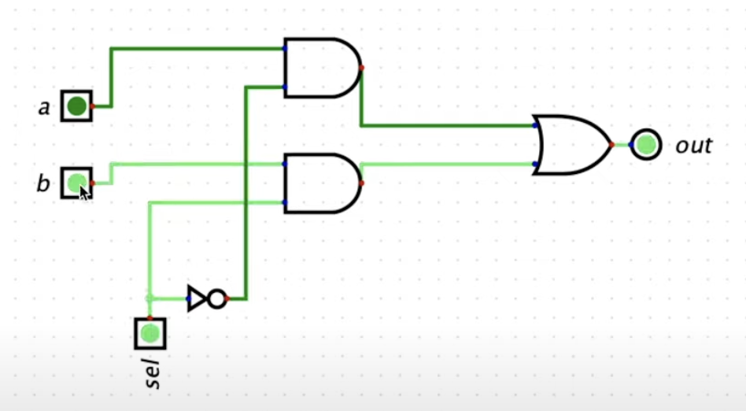

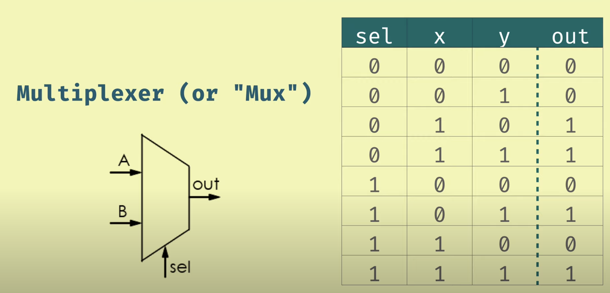

it takes 3 inputs(selector, x, y)

if selector is 0, output is first input. (regardless of second input)\
if selector is 1, output is second input. (regardless of first input)


"if"를 mux로 만든다.


```
// This file is part of www.nand2tetris.org
// and the book "The Elements of Computing Systems"
// by Nisan and Schocken, MIT Press.
// File name: projects/01/Mux.hdl

/**
 * Multiplexor:
 * out = a if sel == 0
 *       b otherwise
 */

CHIP Mux {
    IN a, b, sel;
    OUT out;

    PARTS:
    Not (in=sel, out=notsel);

    And (a=a, b=notsel, out=aAndnotsel);
    And (a=b, b=sel, out=bAndsel);

    Or (a=aAndnotsel, b=bAndsel, out=out);
}
```


### 7. DMUX(de-multiplexor) 's HDL

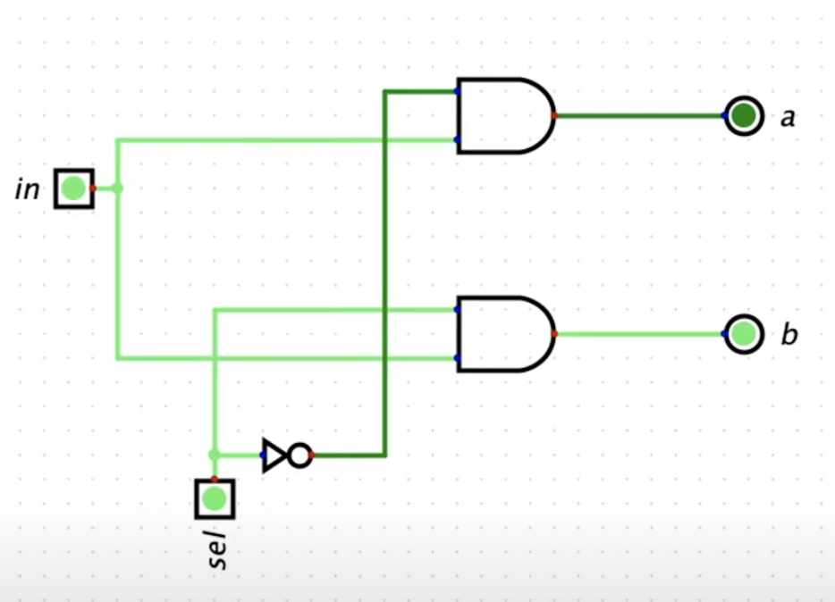

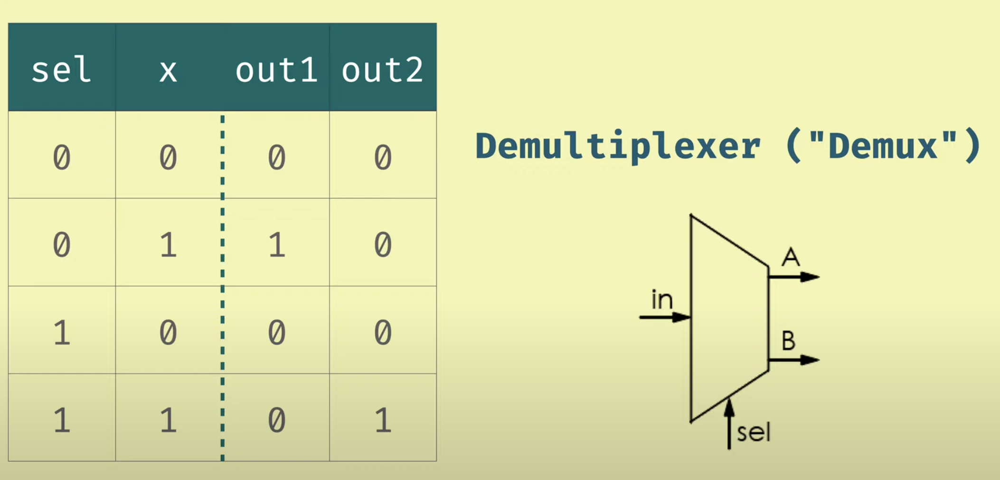

demux taks 1 input and a 'selector'\
and it routes the data to different output, depending on the selector


```
// This file is part of www.nand2tetris.org
// and the book "The Elements of Computing Systems"
// by Nisan and Schocken, MIT Press.
// File name: projects/01/DMux.hdl

/**
 * Demultiplexor:
 * {a, b} = {in, 0} if sel == 0
 *          {0, in} if sel == 1
 */

CHIP DMux {
    IN in, sel;
    OUT a, b;

    PARTS:
    Not (in=sel, out=notsel);

    And (a=in, b=notsel, out=a);
    And (a=in, b=sel, out=b);
}
```


## 2장. boolean arithmetic

gate를 조합하여 half-adder, adder를 만들고,
2진수의 '보수' 성질을 이용하여 +,- 계산기(Arithmetic Logic Unit, ALU)를 만든다.
(곱셈, 나눗셈은 software layer에서 처리)


### 8. Half-Adder's HDL

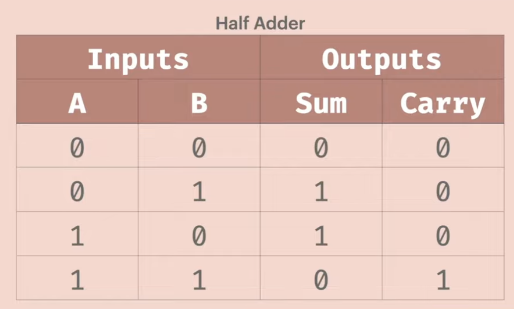

'half' adder라고 불리는 이유는, carry에 대해 암것도 안하기 떄문.

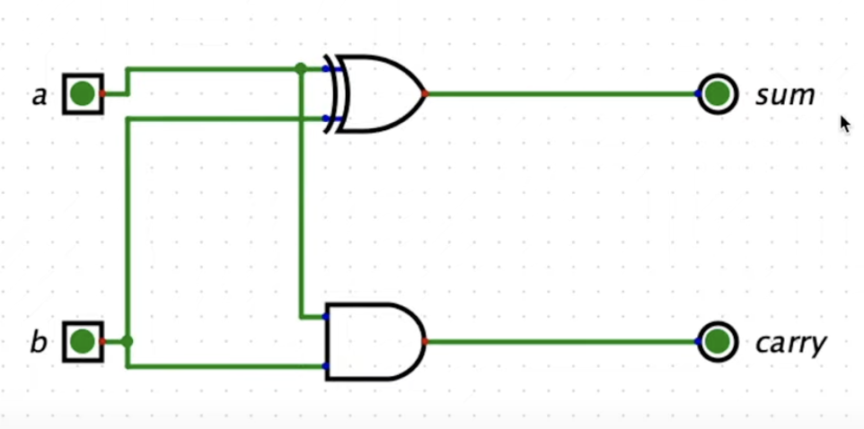


```
// This file is part of www.nand2tetris.org
// and the book "The Elements of Computing Systems"
// by Nisan and Schocken, MIT Press.
// File name: projects/02/HalfAdder.hdl

/**
 * Computes the sum of two bits.
 */

CHIP HalfAdder {
    IN a, b;    // 1-bit inputs
    OUT sum,    // Right bit of a + b
        carry;  // Left bit of a + b

    PARTS:
    Xor (a=a, b=b, out=sum);
    And (a=a, b=b, out=carry);
}
```

### 9. Full-Adder's HDL

'half' adder가 carry에 대해 암것도 안하기 때문에, full adder에서 carry 처리한다.

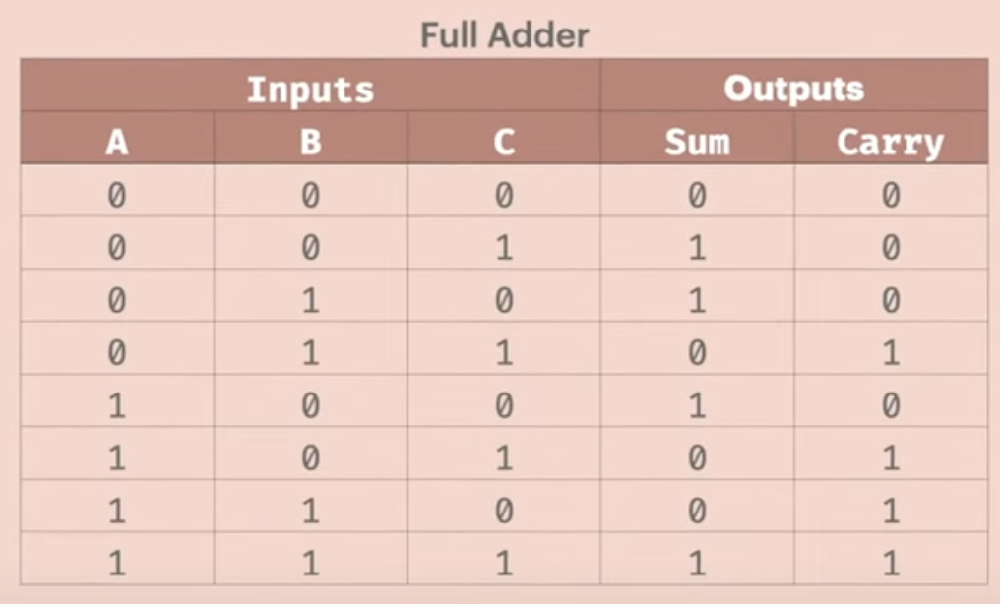

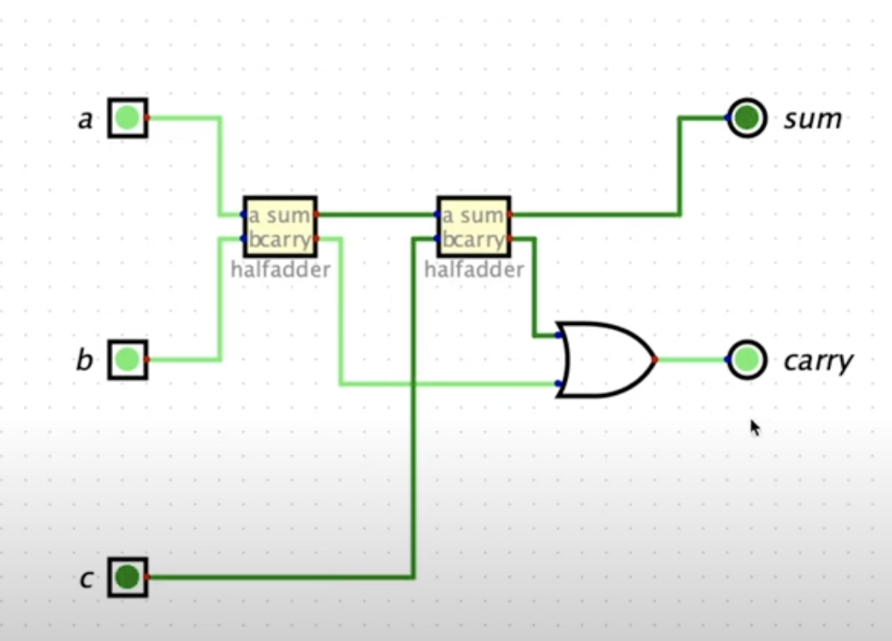


```
// This file is part of www.nand2tetris.org
// and the book "The Elements of Computing Systems"
// by Nisan and Schocken, MIT Press.
// File name: projects/02/FullAdder.hdl

/**
 * Computes the sum of three bits.
 */

CHIP FullAdder {
    IN a, b, c;  // 1-bit inputs
    OUT sum,     // Right bit of a + b + c
        carry;   // Left bit of a + b + c

    PARTS:
    HalfAdder (a=a, b=b, sum=partialSum, carry=firstCarry);
    HalfAdder (a=c, b=partialSum, sum=sum, carry=SecondCarry);
    Or (a=firstCarry, b=SecondCarry, out=carry);
}
```


### 10. Inc16 (incrementor)'s HDL

input + 1 해주는 놈.

int a = 10;
a++;

할 때, 쓰이는 놈인가?


```
// This file is part of www.nand2tetris.org
// and the book "The Elements of Computing Systems"
// by Nisan and Schocken, MIT Press.
// File name: projects/02/Inc16.hdl

/**
 * 16-bit incrementer:
 * out = in + 1 (arithmetic addition)
 */

CHIP Inc16 {
    IN in[16];
    OUT out[16];

    PARTS:
    HalfAdder (a=in[0], b=true, sum=out[0], carry=carry1);
    HalfAdder (a=in[1], b=carry1 , sum=out[1], carry=carry2);
    HalfAdder (a=in[2], b=carry2 , sum=out[2], carry=carry3);
    HalfAdder (a=in[3], b=carry3 , sum=out[3], carry=carry4);
    HalfAdder (a=in[4], b=carry4 , sum=out[4], carry=carry5);
    HalfAdder (a=in[5], b=carry5 , sum=out[5], carry=carry6);
    HalfAdder (a=in[6], b=carry6 , sum=out[6], carry=carry7);
    HalfAdder (a=in[7], b=carry7 , sum=out[7], carry=carry8);
    HalfAdder (a=in[8], b=carry8 , sum=out[8], carry=carry9);
    HalfAdder (a=in[9], b=carry9 , sum=out[9], carry=carry10);
    HalfAdder (a=in[10], b=carry10 , sum=out[10], carry=carry11);
    HalfAdder (a=in[11], b=carry11 , sum=out[11], carry=carry12);
    HalfAdder (a=in[12], b=carry12 , sum=out[12], carry=carry13);
    HalfAdder (a=in[13], b=carry13 , sum=out[13], carry=carry14);
    HalfAdder (a=in[14], b=carry14 , sum=out[14], carry=carry15);
    HalfAdder (a=in[15], b=carry15 , sum=out[15], carry=carry16);
}
```

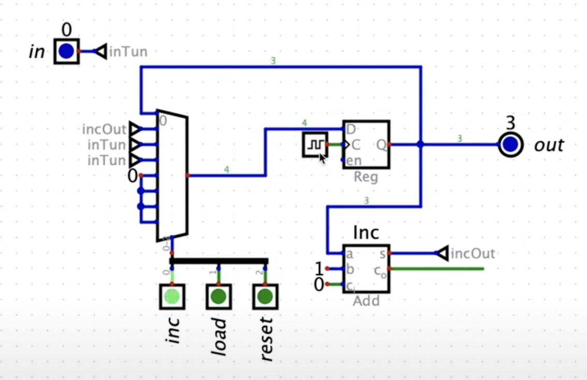

incrementor + program counter


### 11.ALU's HDL

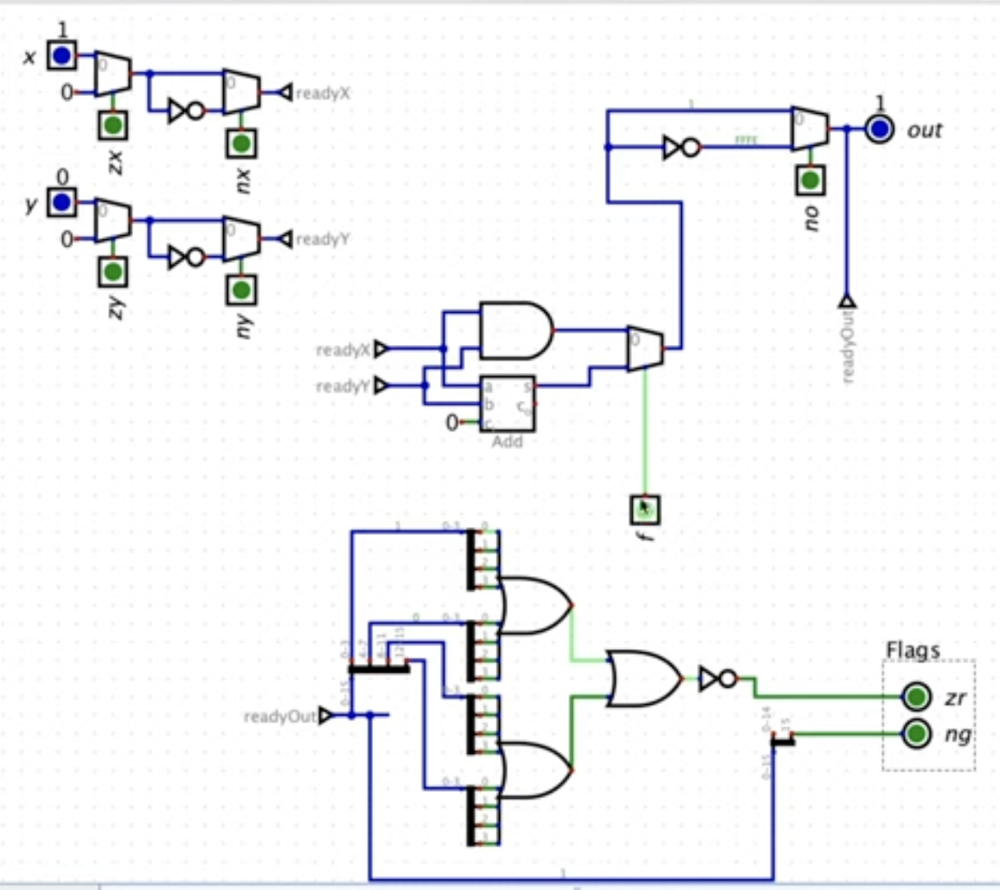


flags = {zx, nx, zy, ny, f, no}

1. zx,nx, zy,ny flags are going to be applied first.
2. then, 'f' will be applied (ex. addition)
3. lastly, 'no' will be applied. 'negate output flag'


```
 // This file is part of www.nand2tetris.org
// and the book "The Elements of Computing Systems"
// by Nisan and Schocken, MIT Press.
// File name: projects/02/ALU.hdl

/**
 * The ALU (Arithmetic Logic Unit).
 * Computes one of the following functions:
 * x+y, x-y, y-x, 0, 1, -1, x, y, -x, -y, !x, !y,
 * x+1, y+1, x-1, y-1, x&y, x|y on two 16-bit inputs,
 * according to 6 input bits denoted zx,nx,zy,ny,f,no.
 * In addition, the ALU computes two 1-bit outputs:
 * if the ALU output == 0, zr is set to 1; otherwise zr is set to 0;
 * if the ALU output < 0, ng is set to 1; otherwise ng is set to 0.
 */

// Implementation: the ALU logic manipulates the x and y inputs
// and operates on the resulting values, as follows:
// if (zx == 1) set x = 0        // 16-bit constant
// if (nx == 1) set x = !x       // bitwise not
// if (zy == 1) set y = 0        // 16-bit constant
// if (ny == 1) set y = !y       // bitwise not
// if (f == 1)  set out = x + y  // integer 2's complement addition
// if (f == 0)  set out = x & y  // bitwise and
// if (no == 1) set out = !out   // bitwise not
// if (out == 0) set zr = 1
// if (out < 0) set ng = 1

CHIP ALU {
    IN
        x[16], y[16],  // 16-bit inputs
        zx, // zero the x input?
        nx, // negate the x input?
        zy, // zero the y input?
        ny, // negate the y input?
        f,  // compute out = x + y (if 1) or x & y (if 0)
        no; // negate the out output?

    OUT
        out[16], // 16-bit output
        zr, // 1 if (out == 0), 0 otherwise
        ng; // 1 if (out < 0),  0 otherwise

    PARTS:
		////////////////////////////////////////////
		//case1) flags별로 나눠서 적용한 HDL
		// ZX and ZY flag handling
		Mux16(a=x, b[0..15]=false, sel=zx, out=xMux);
		Mux16(a=y, b[0..15]=false, sel=zy, out=yMux);


		// NX and NY flag handling
		Not16(in=xMux, out=notX);
		Mux16(a=xMux, b=notX, sel=nx, out=readyX);
		Not16(in=yMux, out=notY);
		Mux16(a=yMux, b=notY, sel=ny, out=readyY);


		// f control bit handling
		And16(a=readyX, b=readyY, out=andOut);
		And16(a=readyX, b=readyY, out=addOut);
		Mux16(a=andOut, b=addOut, sel=f, out=fOut);


		// NO flag handling
		Not16(in=fOut, out=fNotOut);
		Mux16(a=fOut, b=fNotOut, sel=no, out=out, out[15]=ng, out[0..7]=zrLow, out[8..15]=zrHigh);


		// ZR flag handling
		Or8Way(in=zrLow, out=or1Out);
		Or8Way(in=zrHigh, out=or2Out);
		Or(a=or1Out, b=or2Out, out=or3Out);
		Not(in=or3Out, out=zr);


		//////////////////////////////////////////
		//case2) 기존 nand2tetris의 implementation

        //Mux16 (a=x, b=false, sel=zx, out=maybeZeroedX);
        //Mux16 (a=y, b=false, sel=zy, out=maybeZeroedY);

        //Not16 (in=maybeZeroedX, out=negX);
        //Not16 (in=maybeZeroedY, out=negY);

        //Mux16 (a=maybeZeroedX, b=negX, sel=nx, out=transformedX);
        //Mux16 (a=maybeZeroedY, b=negY, sel=ny, out=transformedY);

        //Add16 (a=transformedX, b=transformedY, out=sum);
        //And16 (a=transformedX, b=transformedY, out=and);

        //Mux16 (a=and, b=sum, sel=f, out=output);
        //Not16 (in=output, out=negatedOutput);

        //Mux16 (a=output, b=negatedOutput, sel=no,  out=out, out[15]=ng, out[0..7]=firstHalfOut, out[8..15]=secondHalfOut);

        //Or8Way (in=firstHalfOut, out=firstOr);
        //Or8Way (in=secondHalfOut, out=secondOr);
        //Or (a=firstOr, b=secondOr, out=or16Way);
        //Not (in=or16Way, out=zr);
}

```

gate를 연역적으로 조합해서 만든 것들을
조합해서 덧셈, 뺄셈 가능한 ALU를 만든다.


## 3장. sequential logic

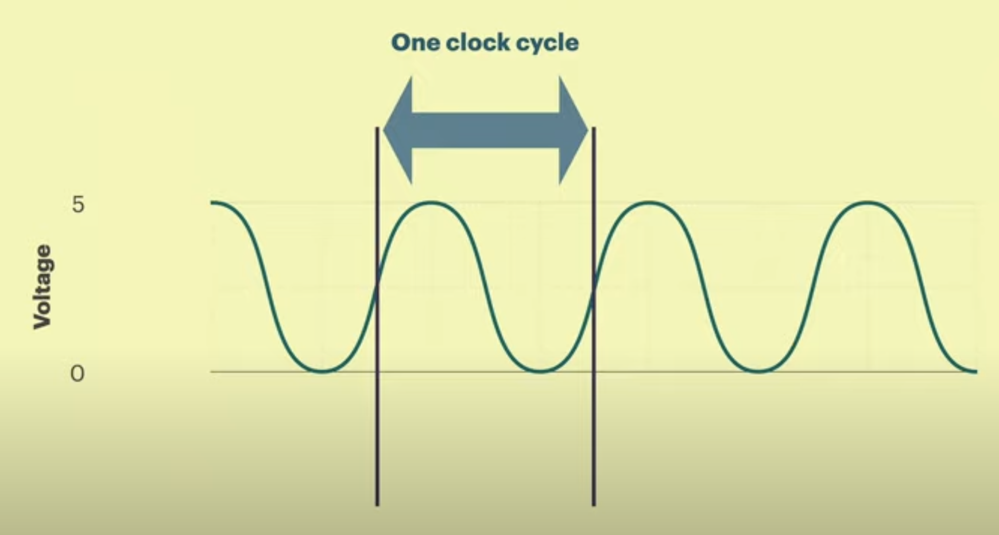

computer는 oscilator를 이용해 voltage가 한번 0 -> +1 -> -1 -> 0 돌아오는 시간, tick-tock을 1 clock cycle, 1 time unit으로 정한다.

시간 지나서 '기억' 하려면, input -> output인 칩이 필요.\
단, 중간에 clock cycle이 1번 돈 이후에 output을 출력하려면, clock도 필요하겠지?\
이게 flip-flop(a.k.a Latch).

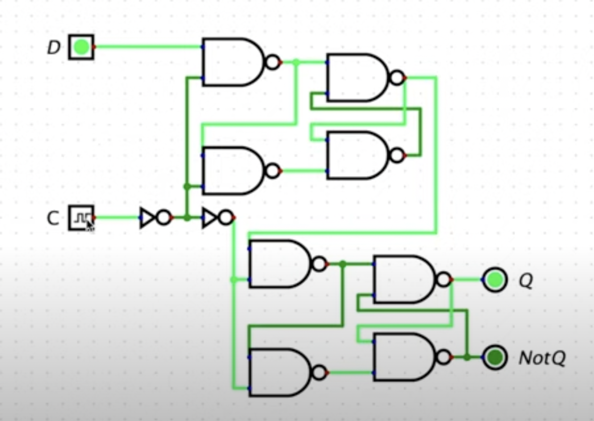
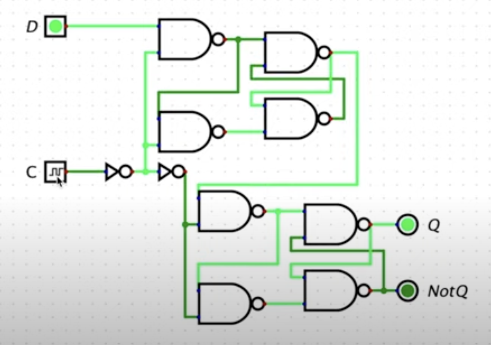

input 'D' is changing, but output 'Q' does NOT change, until clock advances to next cycle.


nand2tetris의 data flip-flop은 delay, hold on a value by '1 clock cycle'


1. data flip-flop
2. bit
3. 16bit-register
4. RAM memory(RAM8, RAM64, ...)
5. Program Counter(PC.hdl)

with these, we can maintain values across time.


### 12. data flip flop's HDL

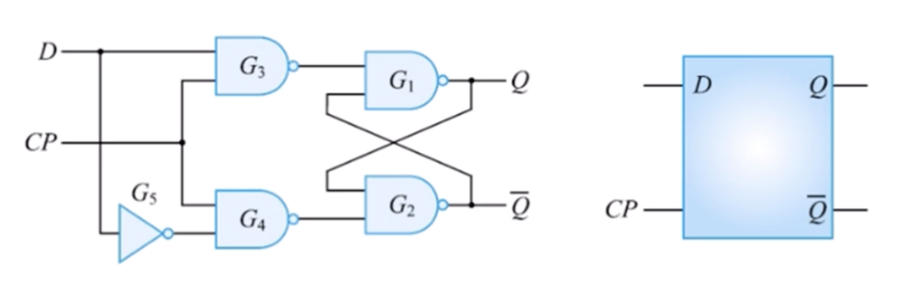


```
// This file is part of www.nand2tetris.org
// and the book "The Elements of Computing Systems"
// by Nisan and Schocken, MIT Press.
// File name: tools/builtIn/DFF.hdl

/**
 * Data Flip-flop: out(t) = in(t-1)
 * where t is the current time unit, or clock cycle.
 */

CHIP DFF {

    IN  in;
    OUT out;

    BUILTIN DFF;
    CLOCKED in;
}
```

self-referencing circuit\
1 clock cycle 이후 input을 output으로 출력한다.


### 13. bit's HDL

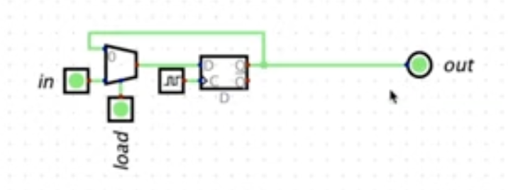

1. 사다리꼴은 multiplexor
2. D라고 써진 칩이 data flip-flop
3. D에 뭍어있는 저 oscilator 모양은 clock

---
input to true 하고, clock을 toggle해도, output엔 변화가 없다.\
왜냐면 load bit is not set.\
if I set input and load bit to 1, output is still zero,\
if you advance the clock, then output becomes 1.


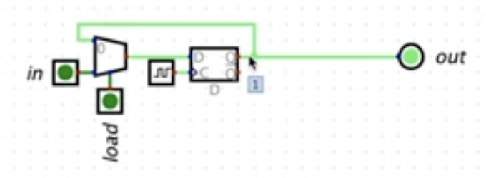

output이 1인 상태에서,\
input, load 둘다 0로 변경한 다음,\
clock cycle을 아무리 많이 advanced한다고 해도,\
output is always 1, because of that loop

---

```
// This file is part of www.nand2tetris.org
// and the book "The Elements of Computing Systems"
// by Nisan and Schocken, MIT Press.
// File name: projects/03/a/Bit.hdl

/**
 * 1-bit register:
 * If load[t] == 1 then out[t+1] = in[t]
 *                 else out does not change (out[t+1] = out[t])
 */

// In clocked chips we can use multiple `out` and those multiple `out`
// Think of intermediate variables as initialized with a 0 value

CHIP Bit {
    IN in, load;
    OUT out;

    PARTS:
    Mux (a=prevResult, b=in, sel=load, out=result);
    DFF (in=result, out=prevResult);
    DFF (in=result, out=out);
}
```

'if' -> multiplexor


### 14. register's HDL

8 bit = 1 register

```
// This file is part of www.nand2tetris.org
// and the book "The Elements of Computing Systems"
// by Nisan and Schocken, MIT Press.
// File name: projects/03/a/Register.hdl

/**
 * 16-bit register:
 * If load[t] == 1 then out[t+1] = in[t]
 * else out does not change
 */

CHIP Register {
    IN in[16], load;
    OUT out[16];

    PARTS:
    Bit (in=in[0], load=load, out=out[0]);
    Bit (in=in[1], load=load, out=out[1]);
    Bit (in=in[2], load=load, out=out[2]);
    Bit (in=in[3], load=load, out=out[3]);
    Bit (in=in[4], load=load, out=out[4]);
    Bit (in=in[5], load=load, out=out[5]);
    Bit (in=in[6], load=load, out=out[6]);
    Bit (in=in[7], load=load, out=out[7]);
    Bit (in=in[8], load=load, out=out[8]);
    Bit (in=in[9], load=load, out=out[9]);
    Bit (in=in[10], load=load, out=out[10]);
    Bit (in=in[11], load=load, out=out[11]);
    Bit (in=in[12], load=load, out=out[12]);
    Bit (in=in[13], load=load, out=out[13]);
    Bit (in=in[14], load=load, out=out[14]);
    Bit (in=in[15], load=load, out=out[15]);
}
```

### 15. RAM8's HDL


64bit (8 register) RAM with memory bank

challenge:\
how to you load new data into the circuits, while still allowing you to persist old value, that are already in the circuits, when new data is not being loaded?


```
// This file is part of www.nand2tetris.org
// and the book "The Elements of Computing Systems"
// by Nisan and Schocken, MIT Press.
// File name: projects/03/a/RAM8.hdl

/**
 * Memory of 8 registers, each 16 bit-wide. Out holds the value
 * stored at the memory location specified by address. If load==1, then
 * the in value is loaded into the memory location specified by address
 * (the loaded value will be emitted to out from the next time step onward).
 */

CHIP RAM8 {
    IN in[16], load, address[3];
    OUT out[16];

    PARTS:
    // 1. Create 8 load values from which we can only have one being 1.
    // 2. Load all in values to the registers with their load value
    // 3. Select the value of the appropriate register

	DMux8Way (in=load, sel=address, a=loadA, b=loadB, c=loadC, d=loadD, e=loadE, f=loadF, g=loadG, h=loadH);

	//memory bank
    Register (in=in, load=loadA, out=registerA);
    Register (in=in, load=loadB, out=registerB);
    Register (in=in, load=loadC, out=registerC);
    Register (in=in, load=loadD, out=registerD);
    Register (in=in, load=loadE, out=registerE);
    Register (in=in, load=loadF, out=registerF);
    Register (in=in, load=loadG, out=registerG);
    Register (in=in, load=loadH, out=registerH);

    Mux8Way16 (a=registerA, b=registerB, c=registerC, d=registerD, e=registerE, f=registerF, g=registerG, h=registerH, sel=address, out=out);
}
```


### 16. Program Counter's HDL

```
// This file is part of www.nand2tetris.org
// and the book "The Elements of Computing Systems"
// by Nisan and Schocken, MIT Press.
// File name: projects/03/a/PC.hdl

/**
 * A 16-bit counter with load and reset control bits.
 * if      (reset[t] == 1) out[t+1] = 0
 * else if (load[t] == 1)  out[t+1] = in[t]
 * else if (inc[t] == 1)   out[t+1] = out[t] + 1  (integer addition)
 * else                    out[t+1] = out[t]
 */

CHIP PC {
    IN in[16],load,inc,reset;
    OUT out[16];

    PARTS:
	//case1) explained by Tea Leaves
	Register(in=resetMuxOut, load=true, out=out, out=regOut);
	Inc16(in=regOut, out=incOut);

	//if(reset[t] == 1) ...
	Mux16(a=loadMuxOut, b[0..15]=false, sel=reset, out=resetMuxOut); // The "reset" mux
	//if(load[t] == 1) ...
	Mux16(a=incMuxOut, b=in, sel=load, out=loadMuxOut) // The "load" mux
	//if(inc[t] == 1) ...
	Mux16(a=regOut, b=incOut, sel=inc, out=incMuxOut); // The "inc" mux


	//case2)
    // Compute the 3 possibilites
    // Decide what to output
    //Not16 (in=true, out=resetVal);
    //Mux16 (a=false, b=in, sel=load, out=loadVal);
    //Inc16 (in=prevOut , out=incOut);
    //Mux16 (a=false, b=incOut, sel=inc, out=incVal);

    //Mux16 (a=prevOut, b=incVal, sel=inc, out=incResult);
    //Mux16 (a=incResult, b=loadVal, sel=load, out=loadResult);
	//Mux16 (a=loadResult, b=resetVal, sel=reset, out=result);

    //Register (in=result, load=true, out=prevOut);
    //Register (in=result, load=true, out=out);
}
```

if -> Multiplexor(MUX)

1. if(reset[t] == 1) -> throw that away!
reset is the most important part.
reset is mux closest to the register. because if reset is true, it doesn't matter what load it is. we will throw them away.


ref: https://youtu.be/lo54MEu7u9A?list=PLu6SHDdOToSdD4-c9nZX2Qu3ZXnNFocOH&t=1090


## 4장. machine code

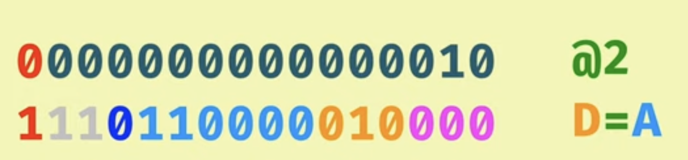

0 == A instruction | 1 == C instruction

first line is A instruction(because it starts with 0)\
A instruction says, put this number in this register.\
@2 == put number 2 in 'A' register.

next line is C instruction(because it starts with 1)\
bit 2nd, 3rd are un-used (grey numbers)\
bit 4th indicates whether the alu will treat the register as a direct or as an index into memory(blue)\
bit 5~10th tells alu what computations to do. (take a look at input of alu above, skyblue)\
bit 11~13th tells what combinations of a,m,d registers the results of the operations to be stored in. (orange)\
bit 14~16th tells the cpu under what conditions, it should jump(goto) that is to change the program counter to new destination.


ex.
```assembly
(LOOP)
	@END
	D;JEQ

	@sum
	M=M+D
	D=D-1

	@LOOP
	0;JMP
```
The above code adds all consecutive integers between 0 and some number, storing the sum in a variable sum.


## 실습

1. sh tools/Assembler.sh
2. load 04/mult/Mult.asm or 04/fill/Fill.asm
3. load .hack file into the sh tools/CPUEmulator.sh and run the program

### part1. Fill.asm -> Fill.hack

1. Fill.asm
```
// This file is part of www.nand2tetris.org
// and the book "The Elements of Computing Systems"
// by Nisan and Schocken, MIT Press.
// File name: projects/04/Fill.asm

// Runs an infinite loop that listens to the keyboard input.
// When a key is pressed (any key), the program blackens the screen,
// i.e. writes "black" in every pixel. When no key is pressed, the
// program clears the screen, i.e. writes "white" in every pixel.

// Put your code here.

  (START)
    // There are 8192 registers dealing with the screen
    // initialize numScreenRegistersToPaint to 8192
    @8192
    D=A
    @numScreenRegistersToPaint
    M=D

    // Set the value of var currentScreenRegister to the first register of the screen
    @SCREEN
    D=A
    @currentScreenRegister
    M=D

    // Set D to the value of keyboard. 0=> No press // 1=> press
    @KBD
    D=M

    // If no press => set paint color to white
    @SETWHITE
    D; JEQ

    // If press => set paint color to black
    @SETBLACK
    0; JMP

  // Set var color to 0
  (SETWHITE)
    @color
    M=0

    @PAINT
    0;JMP

  // Set var color to -1
  (SETBLACK)
    @color
    M=-1

    @PAINT
    0;JMP

  // Paint the screem
  (PAINT)
    // Set D to value of color
    @color
    D=M

    // Set the value of A to the screen register number and modify its value
    // to have the value of color (0 white; -1 black)
    @currentScreenRegister
    A=M
    M=D

    // Add one to currentScreenRegister (to paint the right pixels in the next
    // loop)
    @currentScreenRegister
    M=M+1

    // Subtract 1 from numScreenRegistersToPaint
    @numScreenRegistersToPaint
    M=M-1
    D=M

    // if numScreenRegistersToPaint is 0 => go to start program
    @START
    D; JEQ

    // if numScreenRegistersToPaint is not 0, continue painting
    @PAINT
    0; JMP

```

Fill.hack
```
0010000000000000
1110110000010000
0000000000010000
1110001100001000
0100000000000000
1110110000010000
0000000000010001
1110001100001000
0110000000000000
1111110000010000
0000000000001110
1110001100000010
0000000000010010
1110101010000111
0000000000010010
1110101010001000
0000000000010110
1110101010000111
0000000000010010
1110111010001000
0000000000010110
1110101010000111
0000000000010010
1111110000010000
0000000000010001
1111110000100000
1110001100001000
0000000000010001
1111110111001000
0000000000010000
1111110010001000
1111110000010000
0000000000000000
1110001100000010
0000000000010110
1110101010000111
```

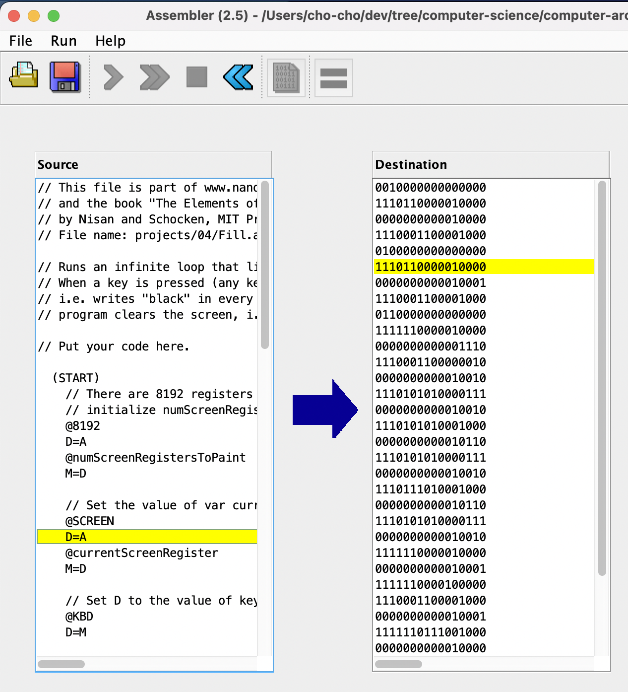

Assembler로 .asm의 어셈블리어를 0101의 기계어로 line by line 번역하는걸 볼 수 있다.


### part 2. CPUEmulator -> run Fill.hack

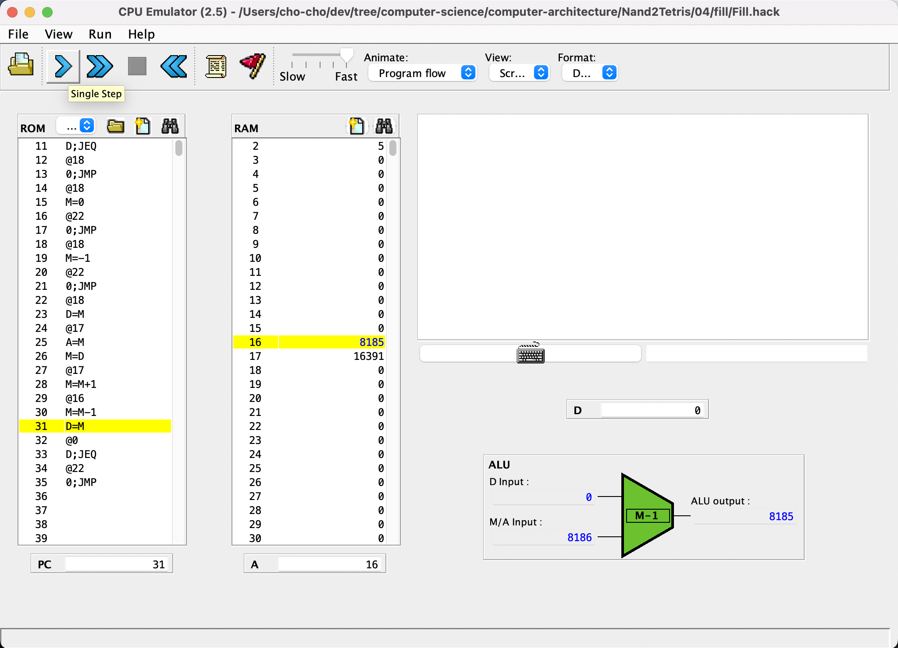

Fill.hack의 machine code가 RAM 메모리 주소에 값을 바꾸는걸 line by line으로 확인 가능하다.

### multiply?

Mult.asm
```
// This file is part of www.nand2tetris.org
// and the book "The Elements of Computing Systems"
// by Nisan and Schocken, MIT Press.
// File name: projects/04/Mult.asm

// Multiplies R0 and R1 and stores the result in R2.
// (R0, R1, R2 refer to RAM[0], RAM[1], and RAM[2], respectively.)

// Put your code here.

// Sum R1 with it self R2 times

// Initialize i to R1
@R1
D=M
@i
M=D

// Initialize result to 0
@R2
M=0

// The loop is going to decrease i by 1 and if its greater than 0 we
// sum R1 to the result if not we go to end
(LOOP)
// If i is 0 => End the program
@i
D=M
@END
D;JEQ

// Add R0 to result
@R0
D=M
@R2
M=D+M

// Decrease the value of i
@i
M=M-1

@LOOP
0; JMP


(END)
@END
0; JMP

```

곱셈을 하려면?
먼저 initialize with 0를 하고,
i번 loop해서 R0를 결과값에 더하기를 반복한다.

결국 곱셈은 더하기 여러번.

---
실습

1. sh CPUEmulator.sh
2. load Mult.hack(recommended) or Mult.asm (also works)
3. click script on left side of red flag to load Mult.tst
4. run


## 5장. Von Neumann architecture

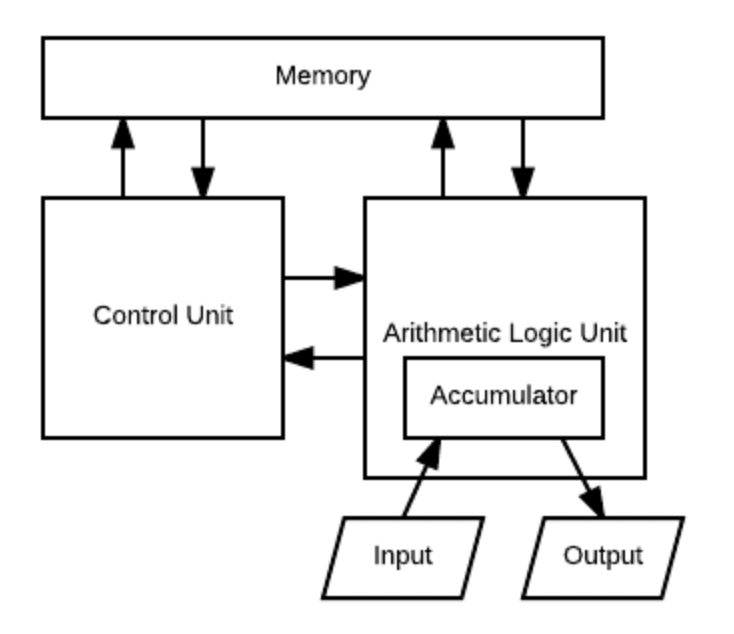

1. instruction decoding
	- what are all these control bits in the instruction telling us to do?
2. instruction execution
	- the ALU is going to operate on these registers/inputs, and send the results to these registers/outputs
3. fetch next instruction
	- jump, or not?

### 17. Memory


monitor의 메모리 주소는 16374~24575\
keyboard는 메모리 주소는 24576~

input과 메모리 주소를 넣어서 해당 메모리 주소의 값을 변경한다.


memory chip modules should use
1. memory we built using gates
2. maps memory to screens & keyboards (so that we can read and write from screen & keyboard)


```Memory.hdl
 * the range 0x4000-0x5FFF results in accessing the screen memory
 * map. Access to address 0x6000 results in accessing the keyboard
 * memory map. The behavior in these addresses is described in the
 * Screen and Keyboard chip specifications given in the book.
 */

CHIP Memory {
    IN in[16], load, address[15];
    OUT out[16];

    PARTS:
    // The first 16K go from 15-bit 0s(all zeros) to 01111111111111
    // The next 8K (screen) go from 100000000000000 to 101111111111111
    // The keyboard is 110000000000000
    // So basically if we get address[14..15]:
    // 11 => keyboard
    // 10 => screen
    // 00 - 01 => RAM

    DMux4Way (in=load, sel=address[13..14], a=firstRAM, b=secondRAM, c=screenLoad, d=kbdLoad);

    Or (a=firstRAM, b=secondRAM, out=ramLoad);
    RAM16K (in=in, load=ramLoad, address=address[0..13], out=ramOut);

    Screen (in=in, load=screenLoad, address=address[0..12], out=screenOut);
    Keyboard (out=kbdOut);

    Mux4Way16 (a=ramOut, b=ramOut, c=screenOut, d=kbdOut, sel=address[13..14], out=out);
}
```

features)

Only the upper 16K+8K+1 words of the Memory chip are used.
Access to address>0x6000 is invalid. Access to any address in the range 0x4000-0x5FFF results in accessing the screen memory map.

Access to address 0x6000 results in accessing the keyboard memory map.
The behavior in these addresses is described in the Screen and Keyboard chip specifications given in the book.


### 18. CPU

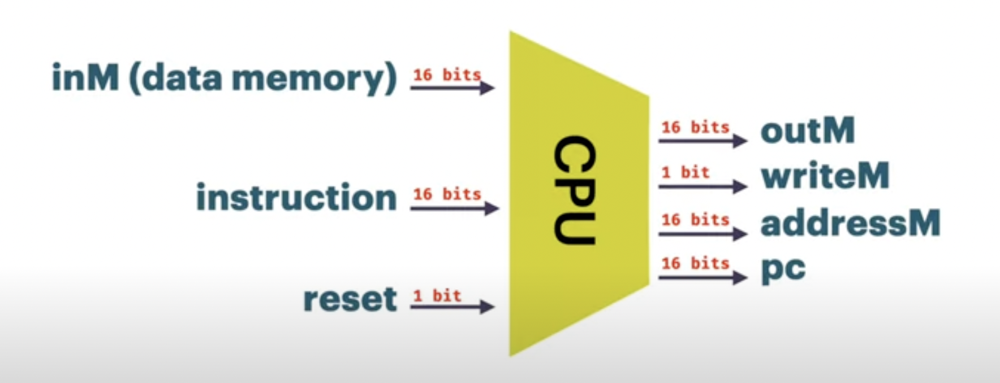

- input
1. inM: contains the piece of memory which is indexed by current value of a register in the cpu. depending on the state of cpu, this might be ignored.
2. instruction: instruction the cpu is going to execute
3. reset: signal whether to restart the program(reset the program counter to 0)

- output
1. outM
2. writeM: if it's 1, we will write the content of 'outM' into  memory location(addressM)
3. addressM
4. pc: indicates what the next value of program counter should be.

---
case1) core of CPU without control bits
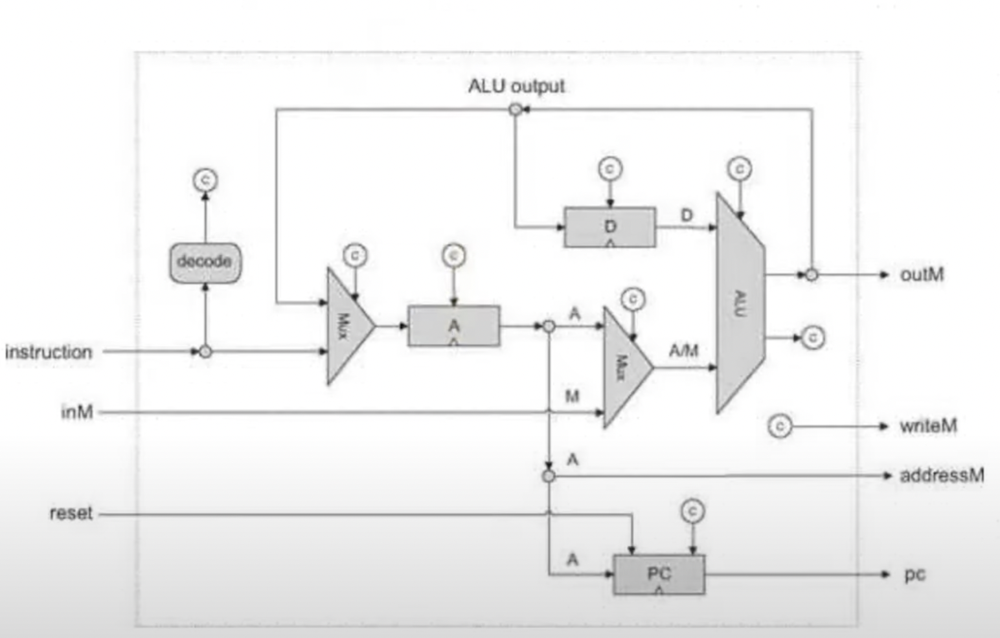


```CPU.asm
// Note this implementation of the CPU doesn't use the given Register A
// and D so in order to test upload `CPU-external.tst`
// Also this implementation uses Mux8Way, a chip not required by any project
// but I found useful to have.

// This file is part of www.nand2tetris.org
// and the book "The Elements of Computing Systems"
// by Nisan and Schocken, MIT Press.
// File name: projects/05/CPU.hdl

/**
 * The Hack CPU (Central Processing unit), consisting of an ALU,
 * two registers named A and D, and a program counter named PC.
 * The CPU is designed to fetch and execute instructions written in
 * the Hack machine language. In particular, functions as follows:
 * Executes the inputted instruction according to the Hack machine
 * language specification. The D and A in the language specification
 * refer to CPU-resident registers, while M refers to the external
 * memory location addressed by A, i.e. to Memory[A]. The inM input
 * holds the value of this location. If the current instruction needs
 * to write a value to M, the value is placed in outM, the address
 * of the target location is placed in the addressM output, and the
 * writeM control bit is asserted. (When writeM==0, any value may
 * appear in outM). The outM and writeM outputs are combinational:
 * they are affected instantaneously by the execution of the current
 * instruction. The addressM and pc outputs are clocked: although they
 * are affected by the execution of the current instruction, they commit
 * to their new values only in the next time step. If reset==1 then the
 * CPU jumps to address 0 (i.e. pc is set to 0 in next time step) rather
 * than to the address resulting from executing the current instruction.
 */

CHIP CPU {

    IN  inM[16],         // M value input  (M = contents of RAM[A])
        instruction[16], // Instruction for execution
        reset;           // Signals whether to re-start the current
                         // program (reset==1) or continue executing
                         // the current program (reset==0).

    OUT outM[16],        // M value output
        writeM,          // Write to M?
        addressM[15],    // Address in data memory (of M)
        pc[15];          // address of next instruction

    PARTS:
    // 1. Divide instruction into its components
    // if A instruction => instructionType == 1
    // if C instruction => instructionType == 0
    And (a=true, b=instruction[15], out=isInstructionC);
    Not (in=isInstructionC, out=isInstructionA);

    // if C instruction the 4th bit of instruction indicates which input to the ALU
    // either input from memory or from registerA
    Or (a=instruction[12], b=false, out=inputType);

    // Set the appropriate bit values for the ALU computation
    Or (a=instruction[11], b=false, out=zx);
    Or (a=instruction[10], b=false, out=nx);
    Or (a=instruction[9], b=false, out=zy);
    Or (a=instruction[8], b=false, out=ny);
    Or (a=instruction[7], b=false, out=f);
    Or (a=instruction[6], b=false, out=no);

    // Set the appropriate values for where we need to store the output of Register
    And (a=instruction[5], b=isInstructionC, out=storeInA);
    And (a=instruction[4], b=isInstructionC, out=storeInD);
    And (a=instruction[3], b=isInstructionC, out=writeM);

    // Compute the 8 bools for different jump options
    // No jump
    Not (in=true, out=nojmp);
    // Jump
    Not (in=false, out=jmp);
    // is Zero
    And (a=true, b=zr, out=jeq);
    // is Neg
    And (a=true, b=ng, out=jlt);
    // is not Zero
    Not (in=zr, out=jne);
    // is Pos
    Not (in=jle, out=jgt);
    // is Zero or Pos
    Or (a=zr, b=jgt, out=jge);
    // is Zero or Neg
    Or (a=zr, b=ng, out=jle);

    // Compute whether we need to jump in the next instruction
    Mux8Way (a=nojmp, b=jgt, c=jeq, d=jge, e=jlt, f=jne, g=jle, h=jmp, sel=instruction[0..2], out=maybeJump);
    And (a=isInstructionC, b=maybeJump, out=shouldJump);

    // possible value to load to registerA
    Mux16 (a=outALU, b=instruction, sel=isInstructionA, out=registerAVal);
    // Only modify value of register A if isInstructionA or storeInA
    Or (a=isInstructionA, b=storeInA, out=shouldLoadA);
    Register (in=registerAVal, load=shouldLoadA, out=registerA, out[0..14]=addressM);

    // Set value of register D to output of ALU if storeInD is 1
    Register (in=outALU, load=storeInD, out=registerD);

    // if inputType is 1 then use M as the ALU input, otherwise user Register A
    // as the input
    Mux16 (a=registerA, b=inM, sel=inputType, out=inputALU);

    ALU (x=registerD, y=inputALU, zx=zx, nx=nx, zy=zy ,ny=ny ,f=f ,no=no, zr=zr, ng=ng, out=outALU);

    Or16 (a=false, b=outALU, out=outM);

    // Calculate the counter. Remember that reset has priority over load and
    // load has priority over inc, that's why we set inc to true (always the default
    // action) should be to increase the counter.
    PC (in=registerA,load=shouldJump,inc=true,reset=reset, out[0..14]=pc);

}
```

---
case2) suggested by 'Tea Leaves'

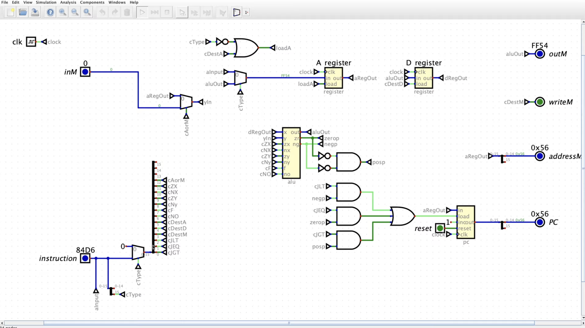


### 19. Computer


```Computer.asm
// Since our CPU implements its own A and D registers to test run with
// these files: ComputerAdd-external.tst,  ComputerMax-external.tst
// ComputerRect-external.tst


// This file is part of www.nand2tetris.org
// and the book "The Elements of Computing Systems"
// by Nisan and Schocken, MIT Press.
// File name: projects/05/Computer.hdl

/**
 * The HACK computer, including CPU, ROM and RAM.
 * When reset is 0, the program stored in the computer's ROM executes.
 * When reset is 1, the execution of the program restarts.
 * Thus, to start a program's execution, reset must be pushed "up" (1)
 * and "down" (0). From this point onward the user is at the mercy of
 * the software. In particular, depending on the program's code, the
 * screen may show some output and the user may be able to interact
 * with the computer via the keyboard.
 */

CHIP Computer {

    IN reset;

    PARTS:
    Memory(in=outMemory ,load=writeM ,address=addressM ,out=inMemory);
    ROM32K (address=pc, out=instruction);
    CPU (reset=reset, instruction=instruction, inM=inMemory, addressM=addressM, writeM=writeM, outM=outMemory, pc=pc);
}
```

- test scripts

1. add.hack
2. max.hack
3. rect.hack (draw a rectable)


## 6장. assembler

assembly language -> binary machine instruction

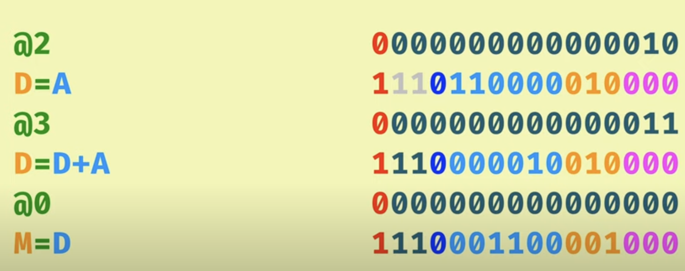

## 7장. virtual machine - stack arthmetic


different CPU have different machine languages


## 8장. virtual machine - program control

## 9장. compiler I - syntax analysis
## 10장. compiler II - code generation

## 11장. operating system

## 12장. high level language


# source

1. website: https://www.nand2tetris.org/
2. course: https://www.coursera.org/learn/build-a-computer
3. book: 밑바닥 부터 만드는 컴퓨팅 시스템

